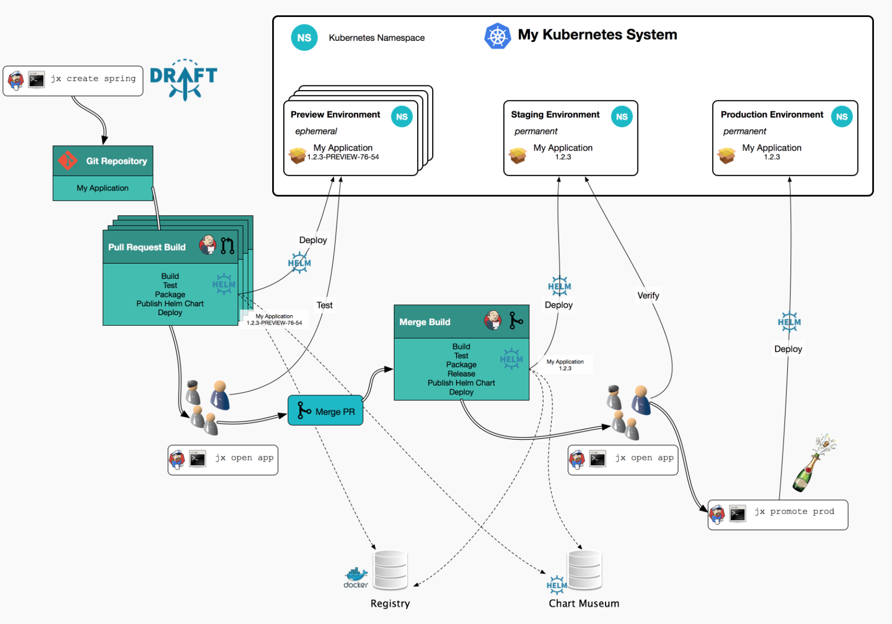

# Jenkins X

[Jenkins X](http://jenkins-x.io/) 是一个基于 Jenkins 和 Kubernetes 的 CI/CD 平台，旨在解决微服务架构下云原生应用的持续集成和持续交付问题。它使用 Jenkins、Helm、Draft、GitOps 以及 Github 等工具链构造了一个从集群安装、环境管理、持续集成、持续部署一直到应用发布等支持整个流程的平台。

## 安装部署

### 安装 jx 命令行工具

```sh
# MacOS
brew tap jenkins-x/jx
brew install jx 

# Linux
curl -L https://github.com/jenkins-x/jx/releases/download/v1.1.10/jx-linux-amd64.tar.gz | tar xzv 
sudo mv jx /usr/local/bin
```

### 部署 Kubernetes 集群

如果 Kubernetes 集群已经部署好了，那么该步可以忽略。

`jx` 命令提供了在公有云中直接部署 Kubernetes 的功能，比如

```sh
create cluster aks      # Create a new kubernetes cluster on AKS: Runs on Azure
create cluster aws      # Create a new kubernetes cluster on AWS with kops
create cluster gke      # Create a new kubernetes cluster on GKE: Runs on Google Cloud
create cluster minikube # Create a new kubernetes cluster with minikube: Runs locally
```

### 部署 Jenkins X 服务

注意在安装 Jenkins X 服务之前，Kubernetes 集群需要开启 RBAC 并开启 insecure docker registries（`dockerd --insecure-registry=10.0.0.0/16` ）。

运行下面的命令按照提示操作，该过程会配置

- Ingress Controller （如果没有安装的话）
- Ingress 公网 IP 的 DNS（默认使用 `ip.xip.io`）
- Github API token（用于创建 github repo 和 webhook）
- Jenkins-X 服务
- 创建 staging 和 production 等示例项目，包括 github repo 以及 Jenkins 配置等

```sh
jx install --provider=kubernetes
```

安装完成后，会输出 Jenkins 的访问入口以及管理员的用户名和密码，用于登录 Jenkins。

## 创建应用

Jenkins X 支持快速创建新的应用

```sh
# 创建 Spring Boot 应用
jx create spring -d web -d actuator

# 创建快速启动项目
jx create quickstart  -l go
```

也支持导入已有的应用，只是需要注意导入前要保证

- 使用 Github 等 git 系统管理源码并设置好 Jenkins webhook
- 添加 Dockerfile、Jenkinsfile 以及运行应用所需要的 Helm Chart

```sh
# 从本地导入
$ cd my-cool-app
$ jx import

# 从 Github 导入
jx import --github --org myname

# 从 URL 导入
jx import --url https://github.com/jenkins-x/spring-boot-web-example.git
```

## 发布应用

```sh
# 发布新版本到生产环境中
jx promote myapp --version 1.2.3 --env production
```



## 常用命令

```sh
# Get pipelines
jx get pipelines

# Get pipeline activities
jx get activities

# Get build logs
jx get build logs -f myapp

# Open Jenkins in brower
jx console

# Get applications
jx get applications

# Get environments
jx get environments
```

