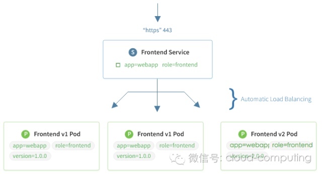
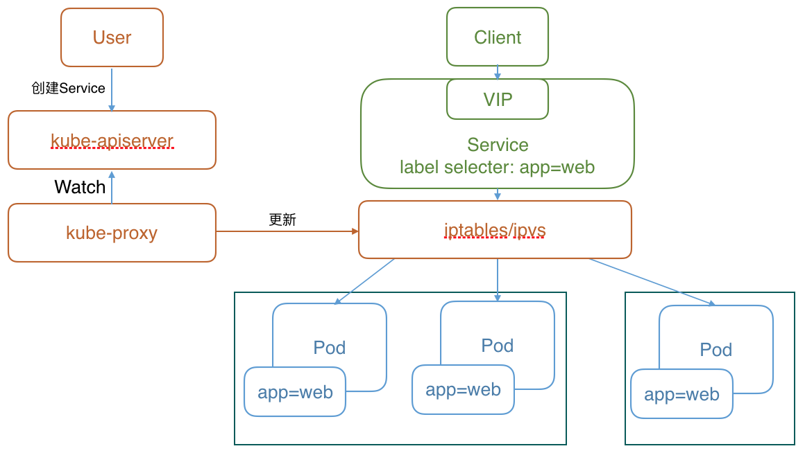

# 服务发现与负载均衡

Kubernetes 在设计之初就充分考虑了针对容器的服务发现与负载均衡机制，提供了 Service 资源，并通过 kube-proxy 配合 cloud provider 来适应不同的应用场景。随着 kubernetes 用户的激增，用户场景的不断丰富，又产生了一些新的负载均衡机制。目前，kubernetes 中的负载均衡大致可以分为以下几种机制，每种机制都有其特定的应用场景：

- Service：直接用 Service 提供 cluster 内部的负载均衡，并借助 cloud provider 提供的 LB 提供外部访问
- Ingress Controller：还是用 Service 提供 cluster 内部的负载均衡，但是通过自定义 Ingress Controller 提供外部访问
- Service Load Balancer：把 load balancer 直接跑在容器中，实现 Bare Metal 的 Service Load Balancer
- Custom Load Balancer：自定义负载均衡，并替代 kube-proxy，一般在物理部署 Kubernetes 时使用，方便接入公司已有的外部服务

## Service



Service 是对一组提供相同功能的 Pods 的抽象，并为它们提供一个统一的入口。借助 Service，应用可以方便的实现服务发现与负载均衡，并实现应用的零宕机升级。Service 通过标签来选取服务后端，一般配合 Replication Controller 或者 Deployment 来保证后端容器的正常运行。这些匹配标签的 Pod IP 和端口列表组成 endpoints，由 kube-proxy 负责将服务 IP 负载均衡到这些 endpoints 上。

Service 有四种类型：

- ClusterIP：默认类型，自动分配一个仅 cluster 内部可以访问的虚拟 IP
- NodePort：在 ClusterIP 基础上为 Service 在每台机器上绑定一个端口，这样就可以通过 `<NodeIP>:NodePort` 来访问该服务。如果 kube-proxy 设置了 `--nodeport-addresses=10.240.0.0/16`（v1.10 支持），那么仅该 NodePort 仅对设置在范围内的 IP 有效。
- LoadBalancer：在 NodePort 的基础上，借助 cloud provider 创建一个外部的负载均衡器，并将请求转发到 `<NodeIP>:NodePort`
- ExternalName：将服务通过 DNS CNAME 记录方式转发到指定的域名（通过 `spec.externlName` 设定）。需要 kube-dns 版本在 1.7 以上。

另外，也可以将已有的服务以 Service 的形式加入到 Kubernetes 集群中来，只需要在创建 Service 的时候不指定 Label selector，而是在 Service 创建好后手动为其添加 endpoint。

### Service 定义

Service 的定义也是通过 yaml 或 json，比如下面定义了一个名为 nginx 的服务，将服务的 80 端口转发到 default namespace 中带有标签 `run=nginx` 的 Pod 的 80 端口

```yaml
apiVersion: v1
kind: Service
metadata:
  labels:
    run: nginx
  name: nginx
  namespace: default
spec:
  ports:
  - port: 80
    protocol: TCP
    targetPort: 80
  selector:
    run: nginx
  sessionAffinity: None
  type: ClusterIP
```

```sh
# service 自动分配了 Cluster IP 10.0.0.108
$ kubectl get service nginx
NAME      CLUSTER-IP   EXTERNAL-IP   PORT(S)   AGE
nginx     10.0.0.108   <none>        80/TCP    18m
# 自动创建的 endpoint
$ kubectl get endpoints nginx
NAME      ENDPOINTS       AGE
nginx     172.17.0.5:80   18m
# Service 自动关联 endpoint
$ kubectl describe service nginx
Name:			nginx
Namespace:		default
Labels:			run=nginx
Annotations:		<none>
Selector:		run=nginx
Type:			ClusterIP
IP:			10.0.0.108
Port:			<unset>	80/TCP
Endpoints:		172.17.0.5:80
Session Affinity:	None
Events:			<none>
```

当服务需要多个端口时，每个端口都必须设置一个名字

```yaml
kind: Service
apiVersion: v1
metadata:
  name: my-service
spec:
  selector:
    app: MyApp
  ports:
  - name: http
    protocol: TCP
    port: 80
    targetPort: 9376
  - name: https
    protocol: TCP
    port: 443
    targetPort: 9377
```

### 协议

Service、Endpoints 和 Pod 支持三种类型的协议：

- TCP（Transmission Control Protocol，传输控制协议）是一种面向连接的、可靠的、基于字节流的传输层通信协议。
- UDP（User Datagram Protocol，用户数据报协议）是一种无连接的传输层协议，用于不可靠信息传送服务。
- SCTP（Stream Control Transmission Protocol，流控制传输协议），用于通过IP网传输SCN（Signaling Communication Network，信令通信网）窄带信令消息。

### API 版本对照表

| Kubernetes 版本 | Core API 版本 |
| --------------- | ------------- |
| v1.5+           | core/v1       |

### 不指定 Selectors 的服务

在创建 Service 的时候，也可以不指定 Selectors，用来将 service 转发到 kubernetes 集群外部的服务（而不是 Pod）。目前支持两种方法

（1）自定义 endpoint，即创建同名的 service 和 endpoint，在 endpoint 中设置外部服务的 IP 和端口

```yaml
kind: Service
apiVersion: v1
metadata:
  name: my-service
spec:
  ports:
    - protocol: TCP
      port: 80
      targetPort: 9376
---
kind: Endpoints
apiVersion: v1
metadata:
  name: my-service
subsets:
  - addresses:
      - ip: 1.2.3.4
    ports:
      - port: 9376
```

（2）通过 DNS 转发，在 service 定义中指定 externalName。此时 DNS 服务会给 `<service-name>.<namespace>.svc.cluster.local` 创建一个 CNAME 记录，其值为 `my.database.example.com`。并且，该服务不会自动分配 Cluster IP，需要通过 service 的 DNS 来访问。

```yaml
kind: Service
apiVersion: v1
metadata:
  name: my-service
  namespace: default
spec:
  type: ExternalName
  externalName: my.database.example.com
```

注意：Endpoints 的 IP 地址不能是 127.0.0.0/8、169.254.0.0/16 和 224.0.0.0/24，也不能是 Kubernetes 中其他服务的 clusterIP。

### Headless 服务

Headless 服务即不需要 Cluster IP 的服务，即在创建服务的时候指定 `spec.clusterIP=None`。包括两种类型

- 不指定 Selectors，但设置 externalName，即上面的（2），通过 CNAME 记录处理
- 指定 Selectors，通过 DNS A 记录设置后端 endpoint 列表

```yaml
apiVersion: v1
kind: Service
metadata:
  labels:
    app: nginx
  name: nginx
spec:
  clusterIP: None
  ports:
  - name: tcp-80-80-3b6tl
    port: 80
    protocol: TCP
    targetPort: 80
  selector:
    app: nginx
  sessionAffinity: None
  type: ClusterIP
---
apiVersion: extensions/v1beta1
kind: Deployment
metadata:
  labels:
    app: nginx
  name: nginx
  namespace: default
spec:
  replicas: 2
  revisionHistoryLimit: 5
  selector:
    matchLabels:
      app: nginx
  template:
    metadata:
      labels:
        app: nginx
    spec:
      containers:
      - image: nginx:latest
        imagePullPolicy: Always
        name: nginx
        resources:
          limits:
            memory: 128Mi
          requests:
            cpu: 200m
            memory: 128Mi
      dnsPolicy: ClusterFirst
      restartPolicy: Always

```

```sh
# 查询创建的 nginx 服务
$ kubectl get service --all-namespaces=true
NAMESPACE     NAME         CLUSTER-IP      EXTERNAL-IP      PORT(S)         AGE
default       nginx        None            <none>           80/TCP          5m
kube-system   kube-dns     172.26.255.70   <none>           53/UDP,53/TCP   1d
$ kubectl get pod
NAME                       READY     STATUS    RESTARTS   AGE       IP           NODE
nginx-2204978904-6o5dg     1/1       Running   0          14s       172.26.2.5   10.0.0.2
nginx-2204978904-qyilx     1/1       Running   0          14s       172.26.1.5   10.0.0.8
$ dig @172.26.255.70  nginx.default.svc.cluster.local
;; ANSWER SECTION:
nginx.default.svc.cluster.local. 30 IN	A	172.26.1.5
nginx.default.svc.cluster.local. 30 IN	A	172.26.2.5
```

备注： 其中 dig 命令查询的信息中，部分信息省略

## 保留源 IP

各种类型的 Service 对源 IP 的处理方法不同：

- ClusterIP Service：使用 iptables 模式，集群内部的源 IP 会保留（不做 SNAT）。如果 client 和 server pod 在同一个 Node 上，那源 IP 就是 client pod 的 IP 地址；如果在不同的 Node 上，源 IP 则取决于网络插件是如何处理的，比如使用 flannel 时，源 IP 是 node flannel IP 地址。
- NodePort Service：默认情况下，源 IP 会做 SNAT，server pod 看到的源 IP 是 Node IP。为了避免这种情况，可以给 service 设置 `spec.ExternalTrafficPolicy=Local` （1.6-1.7 版本设置 Annotation `service.beta.kubernetes.io/external-traffic=OnlyLocal`），让 service 只代理本地 endpoint 的请求（如果没有本地 endpoint 则直接丢包），从而保留源 IP。
- LoadBalancer Service：默认情况下，源 IP 会做 SNAT，server pod 看到的源 IP 是 Node IP。设置 `service.spec.ExternalTrafficPolicy=Local` 后可以自动从云平台负载均衡器中删除没有本地 endpoint 的 Node，从而保留源 IP。

## 工作原理

kube-proxy 负责将 service 负载均衡到后端 Pod 中，如下图所示



## Ingress

Service 虽然解决了服务发现和负载均衡的问题，但它在使用上还是有一些限制，比如

－ 只支持 4 层负载均衡，没有 7 层功能
－ 对外访问的时候，NodePort 类型需要在外部搭建额外的负载均衡，而 LoadBalancer 要求 kubernetes 必须跑在支持的 cloud provider 上面

Ingress 就是为了解决这些限制而引入的新资源，主要用来将服务暴露到 cluster 外面，并且可以自定义服务的访问策略。比如想要通过负载均衡器实现不同子域名到不同服务的访问：

```
foo.bar.com --|                 |-> foo.bar.com s1:80
              | 178.91.123.132  |
bar.foo.com --|                 |-> bar.foo.com s2:80
```

可以这样来定义 Ingress：

```yaml
apiVersion: extensions/v1beta1
kind: Ingress
metadata:
  name: test
spec:
  rules:
  - host: foo.bar.com
    http:
      paths:
      - backend:
          serviceName: s1
          servicePort: 80
  - host: bar.foo.com
    http:
      paths:
      - backend:
          serviceName: s2
          servicePort: 80
```

注意 Ingress 本身并不会自动创建负载均衡器，cluster 中需要运行一个 ingress controller 来根据 Ingress 的定义来管理负载均衡器。目前社区提供了 nginx 和 gce 的参考实现。

Traefik 提供了易用的 Ingress Controller，使用方法见 <https://docs.traefik.io/user-guide/kubernetes/>。

更多 Ingress 和 Ingress Controller 的介绍参见 [ingress](ingress.md)。

## Service Load Balancer

在 Ingress 出现以前，[Service Load Balancer](https://github.com/kubernetes/contrib/tree/master/service-loadbalancer) 是推荐的解决 Service 局限性的方式。Service Load Balancer 将 haproxy 跑在容器中，并监控 service 和 endpoint 的变化，通过容器 IP 对外提供 4 层和 7 层负载均衡服务。

社区提供的 Service Load Balancer 支持四种负载均衡协议：TCP、HTTP、HTTPS 和 SSL TERMINATION，并支持 ACL 访问控制。

> 注意：Service Load Balancer 已不再推荐使用，推荐使用 [Ingress Controller](ingress.md)。

## Custom Load Balancer

虽然 Kubernetes 提供了丰富的负载均衡机制，但在实际使用的时候，还是会碰到一些复杂的场景是它不能支持的，比如

- 接入已有的负载均衡设备
- 多租户网络情况下，容器网络和主机网络是隔离的，这样 `kube-proxy` 就不能正常工作

这个时候就可以自定义组件，并代替 kube-proxy 来做负载均衡。基本的思路是监控 kubernetes 中 service 和 endpoints 的变化，并根据这些变化来配置负载均衡器。比如 weave flux、nginx plus、kube2haproxy 等。

## 集群外部访问服务

Service 的 ClusterIP 是 Kubernetes 内部的虚拟 IP 地址，无法直接从外部直接访问。但如果需要从外部访问这些服务该怎么办呢，有多种方法

* 使用 NodePort 服务在每台机器上绑定一个端口，这样就可以通过 `<NodeIP>:NodePort` 来访问该服务。
* 使用 LoadBalancer 服务借助 Cloud Provider 创建一个外部的负载均衡器，并将请求转发到 `<NodeIP>:NodePort`。该方法仅适用于运行在云平台之中的 Kubernetes 集群。对于物理机部署的集群，可以使用 [MetalLB](https://github.com/google/metallb) 实现类似的功能。
* 使用 Ingress Controller 在 Service 之上创建 L7 负载均衡并对外开放。
* 使用 [ECMP](https://en.wikipedia.org/wiki/Equal-cost_multi-path_routing) 将 Service ClusterIP 网段路由到每个 Node，这样可以直接通过 ClusterIP 来访问服务，甚至也可以直接在集群外部使用 kube-dns。这一版用在物理机部署的情况下。

## 参考资料

- https://kubernetes.io/docs/concepts/services-networking/service/
- https://kubernetes.io/docs/concepts/services-networking/ingress/
- https://github.com/kubernetes/contrib/tree/master/service-loadbalancer
- https://www.nginx.com/blog/load-balancing-kubernetes-services-nginx-plus/
- https://github.com/weaveworks/flux
- https://github.com/AdoHe/kube2haproxy
- [Accessing Kubernetes Services Without Ingress, NodePort, or LoadBalancer](https://medium.com/@kyralak/accessing-kubernetes-services-without-ingress-nodeport-or-loadbalancer-de6061b42d72)
